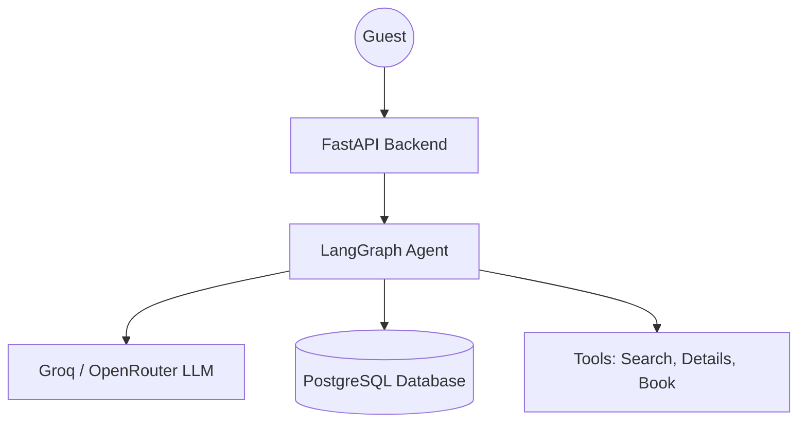

# StayEase AI Assistant

StayEase is an AI-powered rental service assistant designed for guests in Bangladesh. This system allows users to search for available properties, retrieve specific listing details, and book accommodations through a natural language interface.

## 1. System Overview

The system utilizes a modern agentic architecture to provide a seamless conversational experience. It bridges natural language queries with structured property data.

## 2. Conversation Flow

**Step-by-Step Example:**
1.  **User:** "I need a room in Cox's Bazar for 2 nights for 2 guests starting May 1st."
2.  **FastAPI Backend:** Receives the message and initiates a session with the LangGraph agent.
3.  **LangGraph Agent (LLM Node):** Analyzes the intent and extracts parameters: `location="Cox's Bazar"`, `check_in="2026-05-01"`, `nights=2`, `guests=2`.
4.  **Agent Logic:** Decides to call the `search_available_properties` tool.
5.  **Tool Execution:** Queries the database for listings matching the criteria.
6.  **Agent (LLM Node):** Formats the tool output into a friendly response.
7.  **Response:** "I found two options in Cox's Bazar: Ocean View Resort (5,500 BDT/night) and Beachside Haven (4,200 BDT/night). Which one would you like to see more details for?"

## 3. LangGraph State Design

The `State` object maintains the context of the conversation and the assistant's internal status.

| Field Name | Type | Description |
| :--- | :--- | :--- |
| `messages` | `list[BaseMessage]` | Stores the conversation history (Input/Output). |
| `search_params` | `dict` | Persists extracted search criteria across turns. |
| `selected_listing` | `dict` | Stores details of the property currently being discussed. |
| `escalate` | `bool` | Flag to signal hand-off to a human agent. |

## 4. Node Design (3 Nodes)

1.  **`assistant`**
    *   **What it does:** Analyzes user input using the LLM to decide whether to provide a direct response, execute a property tool, or escalate the request.
    *   **What it updates in state:** Appends AI messages containing content or tool call requests to the `messages` history.
    *   **What node comes next:** Routes to `tools` for execution, `escalate` for out-of-scope queries, or `__end__` for direct replies.

2.  **`tools`**
    *   **What it does:** Executes the specific backend tools (Search, Details, or Book) requested by the assistant node.
    *   **What it updates in state:** Appends `ToolMessage` objects containing the results of the tool execution to the `messages` history.
    *   **What node comes next:** Returns to the `assistant` node to interpret the results and formulate a response for the user.

3.  **`escalate`**
    *   **What it does:** Formally marks the conversation as out-of-scope and notifies the guest that a human agent will take over.
    *   **What it updates in state:** Sets the `escalate` flag to `True` and appends the final handover message to the `messages` list.
    *   **What node comes next:** Proceeds to `__end__` to terminate the session.

## 5. Tool Definitions

1.  **`search_available_properties`**
    *   *Params:* `location`, `check_in_date`, `nights`, `guests`.
    *   *Output:* List of available property objects.
2.  **`get_listing_details`**
    *   *Params:* `listing_id`.
    *   *Output:* Full details (amenities, host info, cancellation policy).
3.  **`create_booking`**
    *   *Params:* `listing_id`, `guest_info`, `dates`.
    *   *Output:* Booking confirmation ID and summary.

## 6. Database Schema

The system uses three primary tables in a PostgreSQL database (Neon) to manage properties, bookings, and conversational state.

### 6.1 `listings`
Stores detailed information about rental properties.

| Column Name | Data Type | Constraints | Description |
| :--- | :--- | :--- | :--- |
| `id` | `SERIAL` | `PRIMARY KEY` | Unique identifier for each listing. |
| `name` | `TEXT` | `NOT NULL` | Name of the property. |
| `location` | `TEXT` | `NOT NULL` | City or area (e.g., Cox's Bazar, Sylhet). |
| `price_per_night` | `INTEGER` | `NOT NULL` | Price in BDT per night. |
| `details` | `JSONB` | `DEFAULT '{}'` | Flexible metadata (amenities, policies, ratings). |
| `available` | `BOOLEAN` | `DEFAULT TRUE` | Flag to indicate current availability. |

### 6.2 `bookings`
Stores records of guest reservations.

| Column Name | Data Type | Constraints | Description |
| :--- | :--- | :--- | :--- |
| `id` | `UUID` | `PRIMARY KEY, DEFAULT gen_random_uuid()` | Unique identifier for the booking. |
| `listing_id` | `INTEGER` | `REFERENCES listings(id)` | Foreign key to the booked property. |
| `guest_name` | `TEXT` | `NOT NULL` | Full name of the guest. |
| `check_in` | `DATE` | `NOT NULL` | Start date of the stay. |
| `nights` | `INTEGER` | `NOT NULL, CHECK (nights > 0)` | Duration of the stay. |
| `total_price` | `INTEGER` | `NOT NULL` | Total calculated cost in BDT. |
| `created_at` | `TIMESTAMP` | `DEFAULT CURRENT_TIMESTAMP` | Timestamp when the booking was created. |

### 6.3 `conversations`
Persists the state and history of the AI agent's chat sessions.

| Column Name | Data Type | Constraints | Description |
| :--- | :--- | :--- | :--- |
| `id` | `UUID` | `PRIMARY KEY` | Unique session identifier (`conversation_id`). |
| `user_id` | `TEXT` | `NULLABLE` | Optional identifier for the guest. |
| `history` | `JSONB` | `NOT NULL` | Serialized LangGraph message history. |
| `created_at` | `TIMESTAMP` | `DEFAULT CURRENT_TIMESTAMP` | When the conversation session started. |
